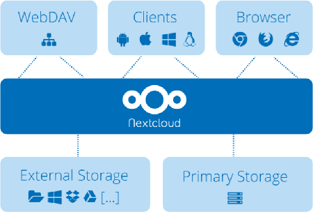
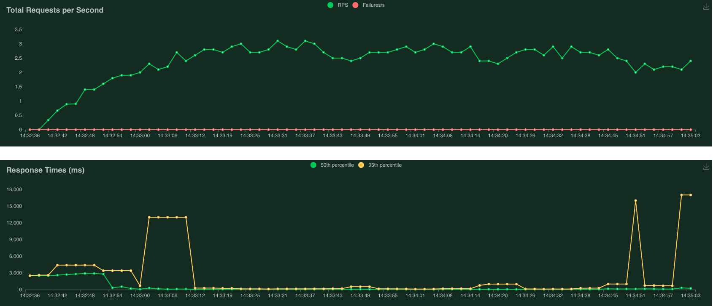
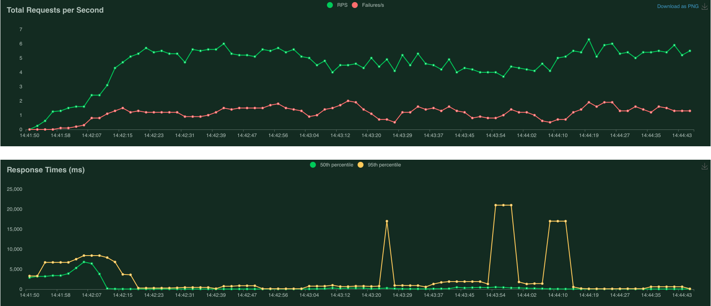

# Cloud-Based File Storage System Project Report

<p align="center" width="100%">
    
</p>


## Introduction

This project aims to address the need for a cloud-based file storage system that enables users to seamlessly upload, download, and delete files while ensuring the privacy of individual storage spaces. In order to not reinvent the wheel and to pursue efficiency, Nextcloud has been selected for its robust features and ease of deployment using Docker containers.

### Choice of Nextcloud

Nextcloud stands out as a suitable choice for this project due to its comprehensive set of functionalities tailored for file management in a cloud environment. It provides a user-friendly interface, robust security measures, and the ability to scale seamlessly. Moreover, the availability of a Docker container for Nextcloud simplifies the deployment process, ensuring a quick and straightforward implementation.

## Nextcloud features

### User Authentication and Authorization with Nextcloud

Nextcloud seamlessly facilitates user authentication and authorization with its built-in features, aligning perfectly with the project requirements:

- **User Registration and Login:** Nextcloud offers a straightforward user registration process, allowing users to sign up, log in, and log out effortlessly. The intuitive interface enhances user experience during these essential interactions.

- **Role-Based Access Control:** Nextcloud inherently supports different user roles, such as regular users and admins. This built-in role-based access control ensures that each user is assigned the appropriate privileges.

- **Private Storage for Regular Users:** Regular users benefit from Nextcloud's default configuration, which allocates a private storage space for each individual, with a limit defined by a Quota.

- **Admin Management Capabilities:** Nextcloud provides an admin dashboard with features to add, remove, and modify user accounts, streamlining the administrative tasks associated with user management.

By default, upon successful authentication, Nextcloud issues an access token that clients will use for all future HTTP requests. This access token should not be stored on any system other than the client requesting it. The user password is also stored encrypted in the Nextcloud database.  

In order to allow users to register by themself using the webinterface the `Registration` app can be installed and enabled, providing the usual email based signup with verification link. In a production setting we would have to setup a server email to provide the verification links and other mail based services.

### Security measures

Nextcloud comes with a set of secure defaults to address the security of the system. In order to implement secure file storage, if the user data is sensible, Nextcloud allows to enable file encryption on the server side. This will reduce the performance of the system but will prevent an intruder that gains access to the data to read it. Enabling file encryption all files can still be shared by a user using the Nextcloud interface but won't be sharable directly from the remote server because they will be encrypted. Note that enabling encryption also increases the amount of space required by each file.

To enable encryption from the web interface simply login as admin, search for the Default Encryption module app and enable it. Then to enable file encryption:
`Administration Settings -> Administration Security -> Server-side encryption`

From command line (using docker):
```bash
docker exec --user www-data nextcloud /var/www/html/occ app:enable encryption
docker exec --user www-data nextcloud /var/www/html/occ encryption:enable
echo "yes" | docker exec -i --user www-data nextcloud /var/www/html/occ encryption:encrypt-all
```

The system won't be secure unless our users have non trivial passwords. From the same configuration page we can harden the password policy by requiring numeric characters or symbols. We can also require the password to be changed every few days.
To prevent unauthorized access and secure user authentication we can also enable 2 factor authentication for all user access.

The clients and the server interact through HTTP protocol, enforcing HTTPS protocol is mandatory in production servers to prevent man in the middle attacks and data snooping.

### Database solutions

During development I opted for a simple sqlite database backend for Nextcloud metadata. In a production environment a more powerful backend should be chosen like PostgreSQL or MariaDB, both supported by Nextcloud. Different databases offer different performances but also different replication systems, which are important when we design the scaling and backup solutions of our platform.    

### Storage solutions

By default Nextcloud stores files in the local file system, which is convenient for a small deployment. In more complex environments it offers flexible solutions for both Object based storage like Amazon S3 and network distributed file systems like NFS. I will discuss in the scaling section the most convenient solution based on our requirements.

### Monitoring

In order to monitor the system performances it is convenient to integrate a monitoring system like Grafana backed up by Prometheus for the data collection. These systems are flexible and can be dockerized for easy setup, allowing to monitor the performances also of local disks and network operations.

### Testing

In order to test the performance of the system in terms of load and IO operations it can be convenient to design stress tests and see how our infrastructure reacts. A python package called `locust` can be used to simulate user interactions with the platform, allowing to gather performance metrics.

## Deployment

The deployment is done through the usage of docker and docker-compose. We leverage docker-compose in order to connect locust to our nextcloud instance.

To simply run the docker containers, assuming you are in the folder containing the `docker-compose.yml` file simply run
```bash
docker-compose up -d
```

By default nextcloud will only address requests made from localhost. To make locust container requests to be accepted by nextcloud we need to add it to the trusted_domains. This is only necessary to make load tests run correctly.

```bash
docker exec --user www-data nextcloud /var/www/html/occ config:system:set trusted_domains 1 --value=nextcloud
```

Locust needs a few users to interact with nextcloud. We can 30 locust test users by running the convenient:
```bash
sh add_users_to_nextcloud.sh
```

It might take a minute for nextcloud to reload its configuration.
To perform load tests we can now use locust web ui from `http://localhost:8089/`. I designed a few tasks that span creating new files of different sizes (1kb, 1mb and 1gb), read a user file, upload a text file and list all files of the user.
> NOTE: The 1 gb file is not included and can be created with `dd if=/dev/zero of=./test-data/file_1gb bs=1M count=1024`

Once the tests are finished we can free up all space used by the test users with
```bash
sh delete_data_test_users.sh
```

I attach two charts of the results, where the run is performed on my laptop which is M2 Macbook Air, note that encryption is enabled during these tests. The tests spawn up to 10 and 20 concurrent users. As we can see my laptop is able to handle 10 users without any failure but starts to struggle and fail requests when we increase to 20.

> 10 user:


> 20 user


Analyzing the locust report with 20 concurrent users reveals server issues, particularly in serving requests. Simple PUT requests experience delays of up to 5 seconds. To pinpoint the problem, additional tests are needed to determine if it's related to CPU or IO constraints.

```
Method  Name	                                                Average   Min     Max (ms)
PUT	/remote.php/dav/files/locust_user0/test_locust_file.txt	407	  35	  4537
[...]
```

## Scalability

I propose two possible solutions to address an increasing demand of the system deployed. Analyzing the advantages/disadvantages and costs of both solutions.

### Solution 1: On-Premise Cluster Deployment

If an organization already owns a cluster of nodes or prefer an on-premise solution, it might be beneficial to deploy Nextcloud on multiple nodes with a shared production-ready database. In this scenario, each node receives user requests, and the data is stored on a shared NFS file system. The database, such as PostgreSQL or MariaDB, needs to be robust and capable of handling concurrent connections from multiple nodes. It is also important to implement a backup system to ensure data integrity and availability in case of node failures.

#### Advantages of Solution 1

1. **Control and Ownership:** Organizations have full control over the hardware and infrastructure.

2. **Customization:** On-premise solutions allow for customization of hardware configurations, optimizing the system to specific performance requirements.

3. **Predictable Costs:** While there may be an initial cost for hardware, an organization can have more predictable and potentially lower operational costs over time.

4. **Security Policies:** An Organization can implement and enforce their own security policies without relying on third-party providers.

5. **Data Residency:** On-premise deployment ensures that data stays within the organization physical or virtual infrastructure, which can be vital in case of very sensible data.

#### Cost Considerations for Solution 1

- **Infrastructure Costs:** An organization bears the cost of owning and maintaining the physical hardware or virtual machines for the cluster nodes. Note that every few years an on premise solution will require updates to the hardware as it becomes outdated or more prone to failures.

- **Backup System Costs:** Implementing a reliable backup system incurs additional costs.

### Solution 2: Cloud Provider Deployment with Autoscaling

Utilizing a cloud provider offers the advantage of scalability and flexibility. In this solution, I propose to use multiple nodes that share a database in the cloud, leveraging the cloud provider's autoscaling capabilities to handle increased load. The data is stored using object storage like Amazon S3, ensuring scalability for file storage. The usage of autoscalability features that most cloud providers offer is a must to reduce the costs and satisfy fluctuating workloads.

#### Why Amazon with S3?

- **Scalability:** Amazon Web Services (AWS) provides robust autoscaling features, allowing the platform to dynamically adjust resources based on demand.

- **Object Storage:** Amazon S3 is a reliable and scalable object storage service, suitable for handling large amounts of file data, it also offers backup options.

- **Managed Database Services:** AWS offers managed database services like Amazon RDS, simplifying database maintenance and scalability, from what I find on the web it should be possible and straightforward to use RDS as backend for Nextcloud.

#### Advantages of Solution 2

1. **Scalability:** Cloud providers offer seamless scalability, allowing an organization to adapt quickly to fluctuating workloads and user demands.

2. **Managed Services:** Using a cloud solution might reduce the burden of infrastructure and database maintenance tasks.

3. **Global Availability:** Cloud providers have data centers worldwide, enabling global accessibility and reducing latency for users in different geographical locations.

4. **Cost Efficiency:** Cloud providers operate on a pay-as-you-go model, potentially lowering costs for an organization with very variable workloads.

#### Cost Considerations for Solution 2

- **Usage-Based Costs:** Cloud providers typically charge based on resource usage, which includes computing resources, storage, and data transfer.

- **Object Storage Costs:** Costs are associated with storing data in object storage services like Amazon S3.

### Cost Optimization

Comparing the two solutions, on-premise deployment (Solution 1) may incur in higher upfront infrastructure costs, but operational costs might be lower. Cloud provider deployment (Solution 2) offers flexibility and scalability, but costs can accumulate based on usage. I would say that the most optimal solution depends on hardware availability and how variable the workloads are.

In order to optimize the costs for Solution 2, assuming the data stored is not sensible or that the cloud service provides additional layers of security one could disable server wise encryption, leading to smaller file sizes and better performances. This might also apply to Solution 1 in case we have limited amount of computing power or storage memory.

As this type of deployment is probably long term the usage of Reserved instances which many cloud providers offer can reduce costs considerably.