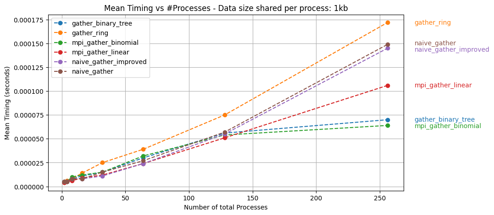
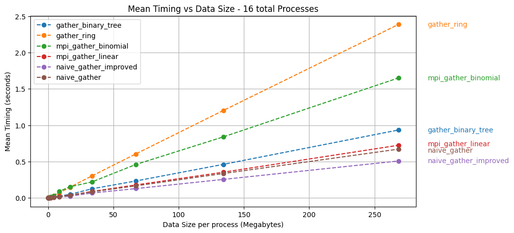

# Final Project HPC - Exercise 2A

## Gather operation using p2p communication.

- Adriano Donninelli - UniTS - adonnine@sissa.it


## Introduction

I have chosen to implement a custom version of the Gather collective operation using point-to-point (p2p) communication in the context of MPI (Message Passing Interface). The gather operation involves the root process collecting data from all other processes. For semplicity I aim to share an array of integers of fixed size from all processes to the root process. Extending the implementations to add tags, custom group communicators and arbitrary data types its quite trivial as OpenMPI p2p communication supports all these features but was left out for simplicity as we pose more attention on the timings of the different solutions.

I will compare my custom gather operations with the different algorithms of the MPI_Gather implementation provided by OpenMPI. For conveniency, in some of the scripts I will assume that root process is rank 0.


## Gather operation

Before proceding let's define how the Gather collective operation works:

Suppose that there are `N` processes and that each has a fixed amount of data with size `K`.
Performing a gather operations means that one particular process, denoted as root receives from all the other processes their chunk of data. At the end of a gather operation the root process will hold a buffer of size `N * K`. The gathered data must be ordered as the processes ranks.

​										


## Experimental Setup

In order to obtain more consistent timings I perform multiple runs of all the algorithms, getting an average run time. I also perform a warmup of the communication channels passing dummy data between the processes. For each solution I only time the actual gather operation and not the variable setup required by different algorithms. To perform all the timings I write a set of bash scripts which allow to perform weak and strong scaling measurements. The tests are performed on ORFEO cluster using the epyc partition. A varying amount of nodes and data sizes is used to assess both weak and strong scaling features of the different implementations, more details in the **Results** section.


## Implementations

Let's discuss the different implementations I propose. Suppose in the following that `N` is the total number of processes. For clarity only the most relevant part of the code is provided.

### naive_gather.c

The first implementation is called `naive_gather` and works by having all processes but root issue a blocking send. Root on the other hand issues `N` blocking receive. This is a simple linear approach with blocking communication.

```c
int* recv_buffer = NULL;
if (rank == 0) 
    recv_buffer = (int*)malloc(size * SEND_COUNT * sizeof(int));
int send_data[SEND_COUNT];
// [...]

int* curr_buffer = recv_buffer;
if (rank != 0)
    MPI_Send(send_data, SEND_COUNT, MPI_INT, 0, rank, MPI_COMM_WORLD);
else
    for (int i=1; i<size; i++){
        curr_buffer += SEND_COUNT;  // Move buffer pointer along
        MPI_Recv(curr_buffer, SEND_COUNT, MPI_INT, i, MPI_ANY_TAG, MPI_COMM_WORLD, &status);
    }
```

In this implementation the root process receives the requests in order, a simple variant (`naive_gather_improved.c`) in which I use non-blocking receive operations is also provided.
I imagined that using non blocking receive would improve results but it proved only marginally effective.


### gather_ring.c

I experimented with a different communication pattern between the processes. Assuming root is rank `0`, I create a ring communication in which each process sends current data to left process until root receives all the data. (The name `gather_pipeline` would have been a more sensible choice). This pattern is not very efficient but is a good exercise.

​				

This way rank `j` receives `N - j - 1` messages and does `N - j` send.
Rank `0` receives `N - 1` messages and does `0` send.

```c
int* recv_buffer = NULL;
if (rank == 0) {
    recv_buffer = (int*)malloc(size * SEND_COUNT * sizeof(int));
} else
    recv_buffer = (int*)malloc(SEND_COUNT * sizeof(int));  // 1 message buffer
int send_data[SEND_COUNT];
[...]

int* curr_buffer = recv_buffer;
MPI_Request req;
MPI_Status status;

if (rank != 0){
    MPI_Send(send_data, SEND_COUNT, MPI_INT, rank - 1, rank, MPI_COMM_WORLD);
    for (int i=0; i<size-rank-1; i++){
        MPI_Recv(recv_buffer, SEND_COUNT, MPI_INT,
                 rank + 1, rank + 1, MPI_COMM_WORLD, &status);
        MPI_Send(recv_buffer, SEND_COUNT, MPI_INT, rank - 1, rank, MPI_COMM_WORLD);
    }
} else {
    for (int i=0; i<size - 1; i++){ // Root receives all communications
        curr_buffer += SEND_COUNT;  // Move buffer pointer along
        MPI_Recv(curr_buffer, SEND_COUNT, MPI_INT, 1, 1, MPI_COMM_WORLD, &status);
    }
}
```

I thought of using buffered non blocking send in order to reuse the buffer and issue a recv before the previous send finishes but while it worked for me locally I received an error on ORFEO. It might be that buffered send are disabled or that I am making some trivial mistake.  `[epyc003] pml_ucx.c:743  Error: bsend: failed to allocate buffer`. The idea was to use the following loop for `rank != 0`:

```c
MPI_Request req;
MPI_Isend(send_data, SEND_COUNT, MPI_INT, rank - 1, rank, MPI_COMM_WORLD, &req);
for (int i=0; i<size-rank-1; i++){
    MPI_Recv(recv_buffer, SEND_COUNT, MPI_INT, rank + 1, rank + 1, MPI_COMM_WORLD, &status);
    MPI_Wait(&req, MPI_STATUS_IGNORE);
    MPI_Ibsend(recv_buffer, SEND_COUNT, MPI_INT, rank - 1, rank, MPI_COMM_WORLD, &req);
}
MPI_Wait(&req, MPI_STATUS_IGNORE);
```

I would expect a better performance with this buffered approach as the next receive operation can be issued before the previous send has finished. In this case a buffered send is required because with a simple non blocking send the `recv_buffer` could be overwritten before it is safe to do so, causing undefined behaviour.


### gather_ring_waitall.c

I propose an even more inefficient variant of the previous approach, which won't be included in the results, where the `j-th` process accumulates all the data coming from its right neighbors before sending it to its left. While inefficient the implementation is quite elegant, with a single send and receive for all but first and last ranks.

```c
if (rank != size - 1)
    MPI_Recv(curr_buffer, (size - rank - 1) * SEND_COUNT, MPI_INT,
             rank + 1, rank + 1, MPI_COMM_WORLD, &status);

if (rank != 0)
    MPI_Send(recv_buffer, (size - rank) * SEND_COUNT, MPI_INT,
             rank - 1, rank, MPI_COMM_WORLD);
```


### gather_binary_tree.c

The last implementation pattern I propose is based on the usage of a binary tree pattern. The set of processes is conceptualized as a binary tree, where each process serves as a node. Beginning with the leaf nodes, each process shares the data with its parent, and this process continues until the root node is reached. As data moves up the tree, each node accumulates data from its children until the root receives it.

​				

> The communications with the same color do not depend on each other and are issued in parallel.

This implementation required more effort because the binary tree pattern is more complex but also because the ranks given by openMPI can't be used directly as tree ranks otherwise the data collected by root will not be ordered.

By observing the way I accumulate data in intermediate buffers along the tree and how the processes are ordered I noticed that I needed to traverse the tree following a preorder traversal pattern to have the data naturally ordered at root. By knowing this I rearranged the ranks of the tree starting from the mpi ranks to gather data correctly.

I write here only a part of the code as it is long. A few variables are previously computed regarding the tree structure:

```c
// [...] Computed variables regarding tree structure
size_t TOTAL_COUNT = (1 + total_descendants) * SEND_COUNT;
size_t RECEIVE_COUNT_LEFT = left_descendants * SEND_COUNT;
size_t RECEIVE_COUNT_RIGHT = right_descendants * SEND_COUNT;

// Each node will have to receive a certain amount of data based on TOTAL number of descendants
int* recv_buffer = (int*)malloc(TOTAL_COUNT * sizeof(int));

// [...] More convenient to copy the send data to the receive buffer.
for (int i=0; i<SEND_COUNT; i++)
    recv_buffer[i] = send_data[i];

int* curr_buffer = recv_buffer;
MPI_Request req_receive[num_children];

// non leaf nodes issue their receive operation. Amount of data differs between layers
if (left_child < size){
    curr_buffer += SEND_COUNT;
    MPI_Irecv(curr_buffer, RECEIVE_COUNT_LEFT, MPI_INT, left_child_rank,
              0, MPI_COMM_WORLD, &req_receive[0]);
    if (right_child < size){
        curr_buffer += RECEIVE_COUNT_LEFT;
        MPI_Irecv(curr_buffer, RECEIVE_COUNT_RIGHT, MPI_INT, right_child_rank,
                  0, MPI_COMM_WORLD, &req_receive[1]);
    }
}

if (num_children) // We wait to receive data from children
    MPI_Waitall(num_children, req_receive, MPI_STATUS_IGNORE);

// Everybody does a send but root! It can be blocking because once it is done the work is finished.
if (rank != 0)
    MPI_Send(recv_buffer, TOTAL_COUNT, MPI_INT, parent_rank, 0, MPI_COMM_WORLD);
```

I also provide a version of the binary tree (`gather_binary_tree_chunks.c`) with message splitting into chunks of fixed size. The code is quite similar but involves some more complex buffer manipulations. The binary tree is executed multiple times with the sharing of different parts of the message. This version did not perform well and the results are not included.


## Results

The experiments are all run using 2 EPYC nodes and varying amount of processes, equally distributed among the nodes. I perform all experiments using map-by `core` policy. I would expect different results using a policy such as `node` but I focus mostly on other aspects of the performance assessment and did not perform tests on this regard.

I compare all timings with the `MPI_Gather` collective operation of OpenMPI. I plot the results of both the `linear` and `binomial` implementations. In order to evaluate the performances of the different algorithms I repeat the timings multiple times. The number of repetitions depend on the number of processes and data size, ranging from up to `10000` iterations for very small data sizes down to `10` for very large ones. Using small data sizes lead to latency bounded tests which are subject to large fluctuations between different runs, therefore using a larger number of repetitions is vital in order to obtain consistent timings.

I perform two different tests, to address both weak and strong scaling. In weak scaling I vary the number of total processes with a fixed amount of data assigned to each one. In strong scaling the amount of data per process varies while the total amount of processes is fixed.

Weak scaling in this scenario allows to inspect how efficiently one of the gather algorithms scales as the number of processes increases. It is important because algorithms such as binary tree, ring and linear have different communication patterns and are expected to scale differently. On the other hand strong scaling allows to inspect how efficiently one of the gather algorithms scale as the data that has to be shared changes. Since ORFEO has powerful communication infrastructure between nodes providing large bandwith for communications it is indeed interesting to inspect strong scaling and see if and how the different communications patterns implemented are able to efficiently utilize the bandwidth capacity.

Both these tests fix one parameter of computation. I varied these fixed values, trying to uncover different aspects of the scaling.


### Weak scaling

First we plot the results of weak scaling for different fixed data sizes. For a small data size per process of `1kb` we get interesting results.

​				
As we can see the binary tree based implementation scales very well with such small data sizes, beaten only by the mpi binomial algorithm. I would expect an even greater gain if we increase the number of cores further. The linear approaches are not very competitive, with timings that get closer to the ring one. We can observe that here `naive_gather` performs worse than the `mpi_gather_linear` even though they should be similar. The results change as we increase the data size. Using `10kb` per process the gain of the binary tree is reduced and the linear approaches now look competitive:
​				
The difference between my `naive_gather` and the original implementation is now negligible.

Increasing further the data sizes to `1mb` only confirms the current trends:
				
I tried with even larger sizes and got similar results. I conclude that linear approaches become more and more competitive as data size increases. On the other hand when the processes share a modest amount of data and the experiments are more latency bounded, approaches based on trees perform well as they divide the problem in multiple parallel layers of communication.


### Strong scaling

Let's see the results of strong scaling for varying amount of processes.
The strong scaling tests increase data size up to the limit of per process memory available (note that the upper bound depends on the fixed amount of processes used and varies between the different plots).

Let's start with `16` processes:
				
As we can see the `naive_gather` implementations are quite efficient with such small amount of processes and scale very well with the data size, while the ring based approach does not, as we previously observed.

Unexpectedly the `binary_tree` approach performs better than the mpi binomial. I think that this might be related to message splitting. Indeed,  by inspecting the timings of the two algorithms for small data sizes we can see a peculiar behaviour after the `1mb` threshold, that might confirm such hypothesis.

​				

Increasing the number of processes to `64` the tree based approaches are still competitive, with a smaller difference between the binary tree and the binomial tree algorithms:
				

With `256` total processes the behaviour does not change:
				

## Conclusion

In this project I implemented and compared custom versions of the Gather operation using point-to-point communication in MPI, including OpenMPI builtin implementations in the evaluation. The implemented approaches included a linear one (`naive_gather`), a ring-based method (`gather_ring`), and a tree-based approach (`gather_binary_tree`). Some variants of these methods were also discusses. Results showed that linear methods performed better with larger data sizes, while tree-based methods were efficient with modest data sharing.

In conclusion, the project explored possible Gather operation implementations in MPI, providing insights into the strengths and weaknesses of the different approaches in various scenarios.