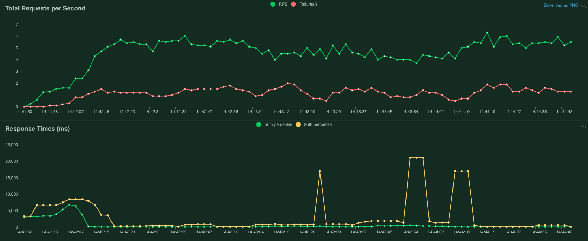

<!-- size: 4:3 -->
<!-- class: invert -->

# Cloud Final Project
## Cloud-Based File Storage System

- Donninelli Adriano

---

<!-- paginate: true -->

## Task:

Exploring and deploying a solution for a cloud-based file storage system.

#### Requested Features:

- Seamless file storage for users
- User / Admin roles
- Dockerized deployment system
- Monitoring / Testing of the platform
- Discuss Security
- Address Scalability

---

## Nextcloud software

In order to not reinvent the wheel I used the Nextcloud software stack:

#### Builtin Features:

- Flexible storage solutions
  (Object based / NFS)
- Customizable database backend
- User / Admin management
- Dockerized deployment
- Production ready security system

---

## Security Measures

To improve Nextcloud default configuration
I applied some additional security measures:

- Server side data encryption
- Hardened password requirements
- 2 Factor Authentication
- Enforced HTTPS protocol

---

## Monitoring

Builtin Nextcloud monitoring or
Grafana + Prometheus solution:

- Deployment using docker-compose
- Easy interface customization
- IO + Network + Nextcloud monitoring

---

## Testing

Locust python package for load / IO testing:

- Deployment using docker-compose
- Testing with varying number of users
- Exportable report for analysis

---

## Scalability

I discuss 2 production ready
scalable deployment solutions:

- On-Premise Cluster Deployment
- Cloud Deployment with Autoscaling

---

## On-Premise Cluster

- Deployment of nextcloud on multiple nodes
- Shared database backend / NFS for storage

#### Pros and Cons:

- Hardware control
- Data residency
- Predictable costs
- Custom security policies
- Infrastructure costs
- Adhoc backup system
- System availability

---

## Cloud deployment

- Deployment on cloud provided stack
- Shared or cloud provided
  (Amazon RDS) database backend
- Object based storage system (S3)

#### Pros and Cons:

- Scalability
- Security
- System availability
- Usage-based costs
- Storage costs

---

## Cost considerations

##### On-premise deployment: 
- High upfront infrastructure costs
  possibly lower operational costs.

##### Cloud provider deployment: 
- Costs accumulate based on usage.

#### Cost Optimization:

- Disable server side encryption.
- Use Reserved instances.