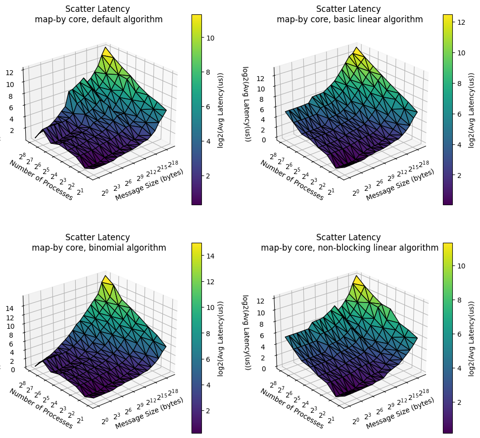
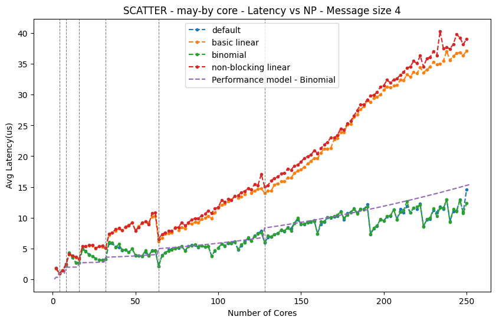

<!-- size: 4:3 -->
<!-- class: invert -->

# HPC - Exercise 1
## Performance Evaluation of OpenMPI Collective Operations

- Donninelli Adriano

---

<!-- paginate: true -->

## Objective:

Performance comparison between
different OpenMPI algorithms:
- Broadcast
  (default / binary tree / pipeline)
- Scatter
  (default / linear / binomial)

---

## Experimental Setup

ORFEO cluster
- 2 EPYC nodes -> 256 cores.
- Tasks distributed evenly
  across the two nodes
- Varying data sizes
- map-by core policy
- bash + python for job setup

---

## Experiments - 1

Comparing different algorithms:

- Cores from 1 to 128 per node
- Message sizes from 1 to $2^{19}$ bytes

3D Heatmaps for visualization

---

<!-- class: default -->

---

---

<!-- class: invert -->

## Experiments - 2

Building performance models:

- Cores from 1 to 128 per node
- Message size fixed to 4 bytes

2D Plot for visualization

---

### Performance models

Different latencies in p2p communication depending on binding:

| Region             | Latency   |
| ------------------ | --------- |
| Same CCX           | 0.15e-6   |
| Same CCD, Diff. CCX | 0.31e-6   |
| Same NUMA          | 0.34e-6   |
| Same SOCKET        | 0.36e-6   |
| Diff. SOCKET        | 0.65e-6   |
| Diff. NODE          | 1.82e-6   |

---

### Pipeline broadcast:
linear unidirectional propagation from root to leaves, left to right.

$$
T_{pipeline} = \sum_{i=0}^{i=N - 1} T_{pt2pt}(i, i+1).
$$

- $N$ is number of cores
- $T_{pt2pt}(i, i+1)$ is the pt2pt latency
  between core $i$ and core $i+1$

---

## Binary tree broadcast Binomial scatter:
$$
T_{tree} = \gamma(N) + \sum_{i=1}^{i=H} T_{pt2pt}(i)\ (1 + f_{overlap}(i)) .
$$

- $N$ number of cores
- $H$ is the height of the tree,
- $T_{pt2pt}(i)$ max pt2pt latency on layer $i$
- $f_{overlap}(i)$ and $\gamma(N)$ penalty factors

---

<!-- class: default -->

---

