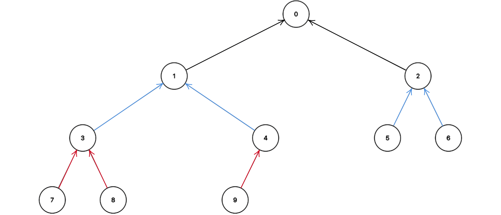
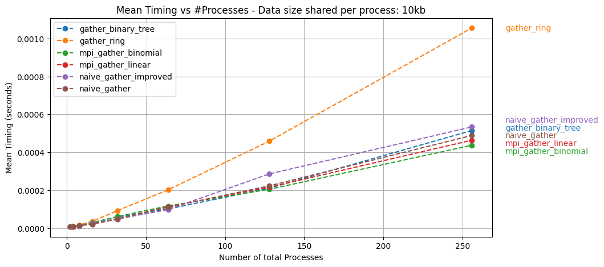
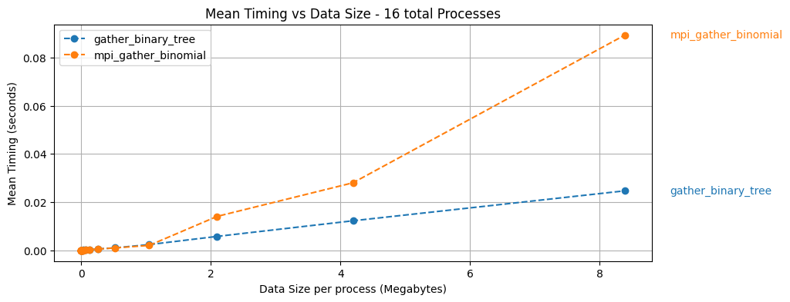
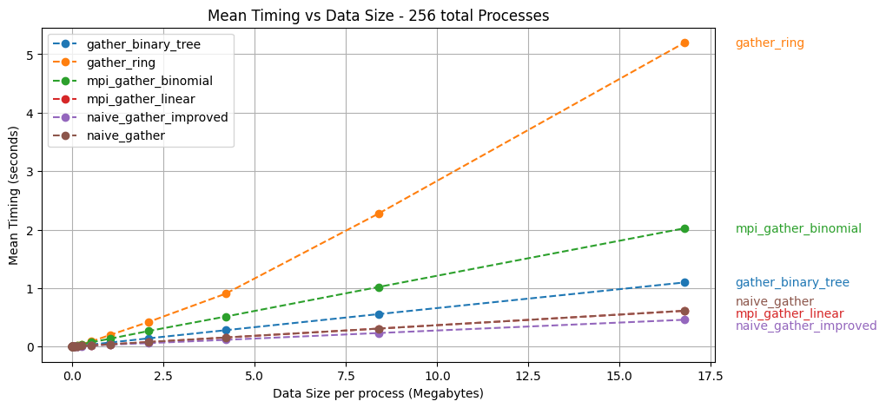

<!-- size: 4:3 -->
<style>
{
  font-size: 35px
}
</style>


# HPC - Exercise 2A
## Gather operation using p2p communication.

---

<!-- paginate: true -->

## Objective:

- Implement the Gather collective operation using only p2p communication
- Compare with OpenMPI implementation

---

## Gather Operation:

The gather collective operation is used to retrieve and store data from all processes onto a single one.

<br>


---

## Experimental Setup

ORFEO cluster
- 2 EPYC nodes -> 256 cores.
- Tasks distributed evenly
  across the two nodes
- map-by core policy
- Strong / Weak scaling
- Compare with OpenMPI
  implementation

---

## Implementations

Multiple implementations with different communication patterns

- Linear
- Ring
- Binary tree


\+ Variants

---

### Naive gather - Linear
All processes but root issue a blocking send.
Root issues `N` blocking receive.

```c
int* recv_buffer = NULL;
if (rank == 0) 
    recv_buffer = (int*)malloc(size * SEND_COUNT * sizeof(int));
int send_data[SEND_COUNT];
// [...]

int* curr_buffer = recv_buffer;
if (rank != 0)
    MPI_Send(send_data, SEND_COUNT, MPI_INT, 0, rank, MPI_COMM_WORLD);
else
    for (int i=1; i<size; i++){
        curr_buffer += SEND_COUNT;  // Move buffer pointer along
        MPI_Recv(curr_buffer, SEND_COUNT, MPI_INT, i, MPI_ANY_TAG, MPI_COMM_WORLD, &status);
    }
```

\+ Variant with non-blocking
   receive operations.

---

### Ring gather
Each process sends data to the left until root.


```c
[...]  // recv_buffer has size N*K on root and K on other processes
int* curr_buffer = recv_buffer;

if (rank != 0){
    MPI_Send(send_data, SEND_COUNT, MPI_INT, rank - 1, rank, MPI_COMM_WORLD);
    for (int i=0; i<size-rank-1; i++){
        MPI_Recv(recv_buffer, SEND_COUNT, MPI_INT,
                 rank + 1, rank + 1, MPI_COMM_WORLD, &status);
        MPI_Send(recv_buffer, SEND_COUNT, MPI_INT,
                 rank - 1, rank, MPI_COMM_WORLD);
    }
} else {
    for (int i=0; i<size - 1; i++){ // Root receives all communications
        curr_buffer += SEND_COUNT;  // Move buffer pointer along
        MPI_Recv(curr_buffer, SEND_COUNT, MPI_INT, 1, 1, 
                  MPI_COMM_WORLD, &status);
    }
}
```

---

### Ring gather improved
Use Buffered non-blocking send,
overlap next receive.

```c
MPI_Request req;
MPI_Isend(send_data, SEND_COUNT, MPI_INT, rank - 1, rank, MPI_COMM_WORLD, &req);
for (int i=0; i<size-rank-1; i++){
    MPI_Recv(recv_buffer, SEND_COUNT, MPI_INT, rank + 1, rank + 1, MPI_COMM_WORLD, &status);
    MPI_Wait(&req, MPI_STATUS_IGNORE);
    MPI_Ibsend(recv_buffer, SEND_COUNT, MPI_INT, rank - 1, rank, MPI_COMM_WORLD, &req);
}
MPI_Wait(&req, MPI_STATUS_IGNORE);
```

##### Inefficient but elegant variant:

```c
if (rank != size - 1)
    MPI_Recv(curr_buffer, (size - rank - 1) * SEND_COUNT, MPI_INT,
             rank + 1, rank + 1, MPI_COMM_WORLD, &status);

if (rank != 0)
    MPI_Send(recv_buffer, (size - rank) * SEND_COUNT, MPI_INT,
             rank - 1, rank, MPI_COMM_WORLD);
```


---

### Binary-tree gather


Each process shares the data with its parent, until root. Data accumulates along layers.

Some engineering effort to make data at root be ordered on arrival.

---

### Binary-tree gather code

```c
[...]
size_t TOTAL_COUNT = (1 + total_descendants) * SEND_COUNT;
size_t RECEIVE_COUNT_LEFT = left_descendants * SEND_COUNT;
size_t RECEIVE_COUNT_RIGHT = right_descendants * SEND_COUNT;
int* recv_buffer = (int*)malloc(TOTAL_COUNT * sizeof(int));

for (int i=0; i<SEND_COUNT; i++)
    recv_buffer[i] = send_data[i];
int* curr_buffer = recv_buffer;
MPI_Request req_receive[num_children];

if (left_child < size){
    curr_buffer += SEND_COUNT;
    MPI_Irecv(curr_buffer, RECEIVE_COUNT_LEFT, MPI_INT, left_child_rank,
              0, MPI_COMM_WORLD, &req_receive[0]);
    if (right_child < size){
        curr_buffer += RECEIVE_COUNT_LEFT;
        MPI_Irecv(curr_buffer, RECEIVE_COUNT_RIGHT, MPI_INT, right_child_rank,
                  0, MPI_COMM_WORLD, &req_receive[1]);
    }
}
if (num_children) // We wait to receive data from children
    MPI_Waitall(num_children, req_receive, MPI_STATUS_IGNORE);
if (rank != 0){
    MPI_Send(recv_buffer, TOTAL_COUNT, MPI_INT, parent_rank, 0, MPI_COMM_WORLD);
```

\+ Variant with message splitting into chunks.

---

### Weak and strong scaling

- Weak scaling: Number of total processes varies, amount of data per process is fixed.
- Strong scaling: Amount of data per process varies, number of processes is fixed.

---

### Weak scaling:




---

### Strong scaling:




---

### Strong scaling:


